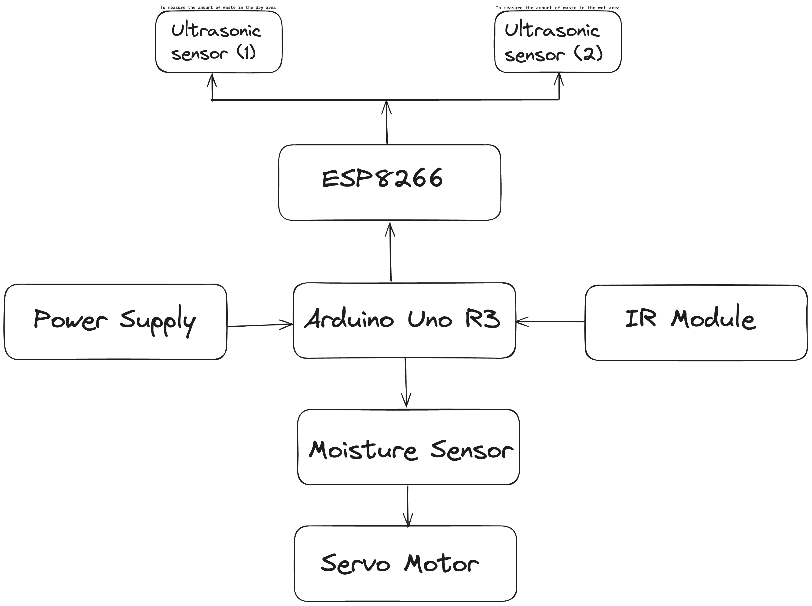

# EnviroTechBin: AI-Powered Waste Sorting and Recycling Assistant

## Overview

>EnviroTechBin represents a groundbreaking initiative aimed at revolutionizing global waste management. Our project focuses on leveraging cutting-edge computer vision and machine learning technologies to tackle the challenges surrounding waste sorting and recycling. By integrating AI-driven solutions, our mission is to provide real-time assistance, educational resources, and community engagement to foster responsible waste management practices and promote recycling efforts globally. ♻️🌍

### Key Features

- **Image Recognition**: Our advanced deep learning models empower the system to accurately identify and categorize various waste items, encompassing plastics, paper, glass, metals, organics, and more. Through this technology, users can gain insights into proper waste disposal. 📷🔍

- **Educational Content**: EnviroTechBin offers a wealth of valuable information on recycling methods, the environmental impact of waste, and locational data for nearby recycling centers. This educational aspect aims to empower users with knowledge to make informed recycling choices. 📚🏭

- **Community Engagement**: Emphasizing a sense of community, the platform encourages users to share their recycling achievements, participate in recycling challenges, and connect with others who prioritize environmental preservation. 🤝🌳

- **Data Analytics**: By collecting and analyzing user data, EnviroTechBin generates valuable insights into recycling behavior. This data contributes to informing local authorities and environmental organizations about trends and patterns, facilitating informed decision-making. 📊📈

## Architecture

### Future Improvements

- **Integration with IoT Devices**: The roadmap includes plans to integrate with IoT devices, enabling smart waste bins capable of automating the waste sorting process.
  
- **Gamification Elements**: Introducing gamification elements like leaderboards and rewards will incentivize and motivate users to actively engage in recycling initiatives.

- **Collaboration with Local Authorities**: Future collaborations with local waste management authorities are envisioned to enhance waste collection systems and upgrade recycling infrastructure. 🌟🤖

# Project Details

> **Goal** :- To develop an advanced waste management system leveraging technology to monitor, sort, and transmit data from waste bins to a web server and to sort wet and dry waste .

### How to Make:

#### Hardware Components:
- Waste Bins
- Ultrasonic Sensors
- Servo Motor
- Microcontroller (Arduino and NodeMCU)
- Wet and Dry Waste Sorting Mechanism
- Wi-Fi Module
- Power Supply

#### Important Points:
- Sensor Placement
- Servo Calibration
- Data Transmission
- Sorting Mechanism
- Power Efficiency

### Working of the Project:

>The system operates by automatically opening its lid when a user approaches, employing an intelligent waste sorting mechanism to discern between wet and dry waste. Ultrasonic sensors continuously monitor fill levels and transmit real-time data to a web server via a NodeMCU-driven microcontroller through a Wi-Fi module. Municipal waste management authorities can efficiently plan collection routes, prioritize bins, and engage the community for responsible waste disposal and recycling.

### Advanced Features:

>The EnviroTechBin project combines automation, sensor technology, data analysis, and remote monitoring to simplify waste disposal, optimize collection routes, reduce costs, and promote sustainability, setting it apart from traditional waste bins.

### Total Cost:

₹1500

## Contact

For any questions or inquiries, please reach out to us via email at codewithriza@gmail.com. ✉️
